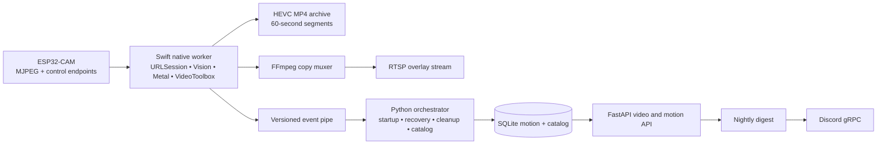
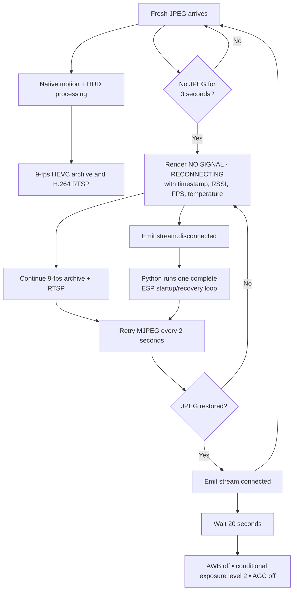

# CCTV

A self-hosted CCTV automation stack for ESP32-CAM devices. It captures the camera stream, overlays health metrics, records segmented video, restreams RTSP, logs motion events, exposes them over a FastAPI service, and delivers nightly summaries with motion clips to a Discord channel via gRPC.

## Highlights

- Continuous ESP32-CAM management with automatic reboot, quality ramp-up, and clock sync via `utilities/startup.py`.
- Apple Silicon-native Swift capture worker with VideoToolbox motion estimation, candidate-only indoor person/animal recognition, and a GPU-composited timestamp/RSSI/FPS/temperature HUD. The Python/OpenCV pipeline remains an automatic fallback.
- Hardware HEVC archive recording plus hardware H.264 RTSP output; FFmpeg is only the RTSP muxer. The orchestrator also maintains an indexed recording catalog and batch disk pruning with hysteresis.
- Motion-event persistence in SQLite via SQLAlchemy (`utilities/motion_db.py`) powering a FastAPI service at `server/server.py` for searching, merging, and streaming footage.
- Nightly automation (`motion/motion.py`) that fetches motion windows, downloads footage, compresses clips with Apple Silicon's VideoToolbox (`h264_videotoolbox`) to stay under Discord's webhook file limit, and posts summaries + clips to Discord via gRPC.
- Discord webhook gRPC client (`discord_grpc/`) generated from `proto/discord_webhook.proto`; sends text, images, and videos to a channel by name (default: `cctv`) through an external gRPC server at `127.0.0.1:50051`.
- Operator tooling for camera controls, LED brightness, stream health, and RSSI checks under `tools/`.

## Measured Apple Silicon Improvements

Live measurements on Apple M4, comparing the legacy Python/OpenCV capture path
with the native worker's complete process tree:

| Metric | Legacy path | Native path | Change |
| --- | ---: | ---: | ---: |
| Median CPU (`top`) | 58.6% | 20.15% | 65.6% lower |
| p95 CPU (`top`) | 61.2% | 21.0% | 65.7% lower |
| Representative 60-second archive | 5.46 MB H.264 | 1.68 MB HEVC | 69.3% smaller |
| Output cadence | 9 fps | 9 fps | Preserved |

The ESP32-CAM supplies approximately 4–6 fresh frames per second in the tested
indoor conditions, chiefly due to its exposure and stream cadence. Native frame
pacing preserves a valid 9-fps archive and RTSP timeline without inventing a
higher camera FPS in the HUD. A controlled reboot also produced a valid 540-frame,
59.998-second no-signal/recovery segment. Raw reports are in `benchmarks/`.

## Repository Layout

```
Image Processing/   Capture + motion pipeline and orchestrator utilities
native/             Swift/VideoToolbox/Core Image capture worker and tests
motion/             Nightly downloader, VideoToolbox compressor, and Discord sender
server/             FastAPI application that exposes recordings and motion APIs
discord_grpc/       gRPC client for the Discord webhook service (from proto/discord_webhook.proto)
proto/              Protobuf definitions for the Discord webhook gRPC contract
tools/              Camera control utilities (quality, reset, LED, RSSI, etc.)
utilities/          Shared helpers (startup automation, SQLite logging, warnings)
launchd/            launchd plists for the orchestrator and FastAPI server
run_motion.sh       Apple Silicon launcher for the nightly motion digest
```

## Architecture Overview



```
ESP32-CAM MJPEG → Swift native worker ─┬─ VideoToolbox HEVC → segmented MP4 archive
                                      ├─ VideoToolbox H.264 → FFmpeg copy mux → RTSP
                                      └─ versioned events → Python orchestrator
                                                                     │
                                     ┌───────────────────────────────┼─ Storage monitor trims oldest footage when full
                                     │                               ├─ SQLite motion log (utilities/motion_db.py)
                                     │                               ├─ FastAPI server (server/server.py, port 8005) for video & motion APIs
                                     │                               └─ Nightly job (motion/motion.py) → Discord gRPC (#cctv)
                                     │
                Discord webhook gRPC server (127.0.0.1:50051) ←── send_text / send_image / send_video
```

### Camera Signal Recovery



## Requirements

- macOS 26 on Apple Silicon with Python 3.12+ and the full Xcode toolchain.
- FFmpeg CLI with `h264_videotoolbox` support (`brew install ffmpeg`).
- OpenCV build with FFMPEG support.
- ESP32-CAM or compatible device serving MJPEG/HTTP control endpoints (defaults assume `192.168.0.13`).
- SQLite (bundled with Python) and write access to `/Volumes/drive/CCTV/recordings/esp_cam1` (default) or a custom path via `CCTV_RECORDINGS_DIR`.
- Discord webhook gRPC server listening at `127.0.0.1:50051` (a separate launchd job, `com.aneesh.discord-webhook-grpc`).

### Python Dependencies

Install into a virtual environment:

```bash
python -m venv .venv
source .venv/bin/activate
pip install --upgrade pip
pip install -r requirements.txt
```

> Edit `requirements.txt` if you split optional features across environments.

## Configuration

1. **Camera endpoints** – Update IPs in:

   - `Image Processing/camera_pipeline.py`
   - `utilities/startup.py`
   - `tools/*.py`
   - `motion/motion.py`

2. **Recording paths** – By default recordings are written to `/Volumes/drive/CCTV/recordings/esp_cam1` on the external drive. Override with `CCTV_RECORDINGS_DIR` if you use a different mount.

   Native controls include `CCTV_PIPELINE_BACKEND=native|python`, `CCTV_NATIVE_BINARY`, `CCTV_TARGET_FPS` (default `9`), `CCTV_HEVC_BITRATE` (default `500000`), `CCTV_RTSP_BITRATE` (default `1500000`), and `CCTV_POST_CONNECT_ADJUSTMENT_DELAY_SECONDS` (default `20`). Three native failures within five minutes latch the orchestrator to the Python fallback until restart.

3. **Environment variables** – A `.env` file is optional. Set `OPENAI_API_KEY` if you run the AI daily digest (`motion/night_message.py`).

4. **Discord webhook gRPC** – The nightly digest sends messages and clips to a Discord channel through a gRPC server. Configure with:

   ```
   DISCORD_GRPC_TARGET=127.0.0.1:50051   # gRPC server address
   DISCORD_CHANNEL=cctv                   # target Discord channel name
   DISCORD_USERNAME=                      # optional webhook display name override
   DISCORD_AVATAR_URL=                    # optional webhook avatar override
   ```

   Regenerate the client stubs after editing the proto:

   ```bash
   python -m grpc_tools.protoc -Iproto --python_out=discord_grpc --grpc_python_out=discord_grpc proto/discord_webhook.proto
   ```

5. **Video compression** – `motion/motion.py` compresses clips with Apple Silicon's `h264_videotoolbox` encoder. The target size is 9.5 MB to fit Discord's standard webhook upload limit; see `discord_grpc.DISCORD_FILE_LIMIT_BYTES` to adjust.

## Running the Services

### 1. Camera Capture + Storage Monitor

```bash
./scripts/build-native.sh
source .venv/bin/activate
python -m image_processing.pipeline_orchestrator
```

This launches the native worker, H.264 RTSP muxer, indexed HEVC recorder, and background disk cleanup job. Set `CCTV_PIPELINE_BACKEND=python` to force the legacy fallback.

### 2. FastAPI Video Server

```bash
source .venv/bin/activate
python server/server.py
```

The server listens on `0.0.0.0:8005` by default and exposes documentation at `/docs`.

Common API routes:

- `GET /video/list` – Listing of available recordings with timestamps and sizes.
- `GET /video/by-duration?timestamp=YYYY-MM-DDTHH:MM:SS&minutes=30` – Merge a custom window and return a single MP4.
- `GET /video/by-hour`, `GET /video/by-day`, `GET /video/by-timestamp` – Convenience merges.
- `GET /motion/logs?hours=12`, `/motion/range`, `/motion/day`, `/motion/stats` – Motion event queries backed by SQLite.
- `GET /nightevents` and `/nightevents/{index}` – Serve previously generated nightly clips.

### 3. Nightly Motion Digest

To run ad hoc:

```bash
source .venv/bin/activate
python motion/motion.py
```

For scheduled execution (e.g., via cron), use `run_motion.sh`, which activates the virtual environment, runs the script, and logs to `motion/motion.log`.

### 4. Daily AI Digest

```bash
source .venv/bin/activate
python motion/night_message.py
```

Generates yesterday's motion-plot images, asks the OpenAI model for a short summary, and posts both to Discord via gRPC (`send_text` + `send_image`).

## launchd Services (macOS)

Two persistent agents live in `launchd/` and are installed into `~/Library/LaunchAgents/`:

- `com.aneesh.cctv.orchestrator` – runs `image_processing.pipeline_orchestrator` with `KeepAlive` so the capture/record/RTSP pipeline restarts on failure.
- `com.aneesh.cctv.server` – runs `server.server` (FastAPI on `0.0.0.0:8005`) with `KeepAlive`.

Install / reload both:

```bash
cp launchd/*.plist ~/Library/LaunchAgents/
launchctl load ~/Library/LaunchAgents/com.aneesh.cctv.orchestrator.plist
launchctl load ~/Library/LaunchAgents/com.aneesh.cctv.server.plist
```

Logs are written to `~/Library/Logs/CCTV/*.log`. Restart a job with:

```bash
launchctl kickstart -k gui/$(id -u)/com.aneesh.cctv.server
```

## Storage & Maintenance

- **Disk pruning** – The orchestrator starts pruning at 90% and deletes finalized segments in one batch toward 85%, avoiding the old 89–90% cleanup loop.
- **Motion logging** – The native detector sends finalized events to the Python orchestrator, which preserves `motion_events_new` and stores optional person/animal labels in an additive annotation table.
- **Signal recovery** – After three seconds without a JPEG, native recording and RTSP continue with the full HUD over a `NO SIGNAL · RECONNECTING` screen. Reconnect attempts run every two seconds while the orchestrator coalesces disconnect events into one complete ESP startup sequence.
- **Post-connect camera tuning** – After a stable MJPEG connection, the orchestrator waits 20 seconds, disables automatic white balance, applies exposure level 2 outside the 12pm–6pm IST exclusion window, and disables automatic gain. A disconnect cancels stale tuning work and the sequence runs again after recovery.
- **Performance measurement** – `tools/benchmark_pipeline.py <orchestrator-pid> --output benchmarks/run.json` records raw `top` data and process-tree median/p95 CPU.
- **Health overlays** – Wi-Fi RSSI (`tools/get_rssi.py`) and ESP SoC temperature (`/syshealth`) power on-screen badges. These requests fail gracefully if endpoints are unreachable.

## Development Tips

- The codebase assumes a single camera. To add more, replicate `camera_pipeline.py` with per-camera constants or abstract them into configuration objects.
- When making IP or credential changes, update both the startup helpers and the motion digest scripts to keep all services aligned.
- Enable `SHOW_LOCAL_VIEW` in `camera_pipeline.py` for debugging overlays, but note the added GUI dependency.
- Use the FastAPI docs UI to exercise the API, especially merge endpoints that rely on sequential file naming.
- Regenerate the Discord gRPC client (`discord_grpc/`) whenever the proto changes — see the Configuration section.

## License

Released under the [GNU General Public License v3.0](LICENSE).
