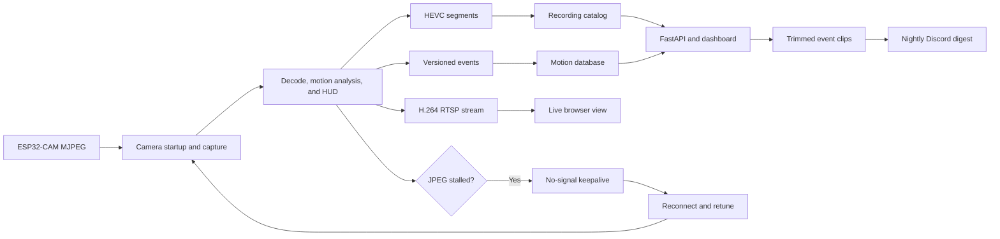
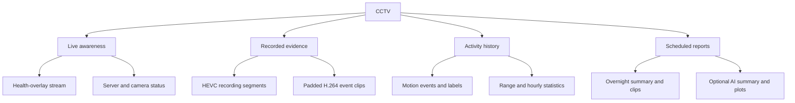
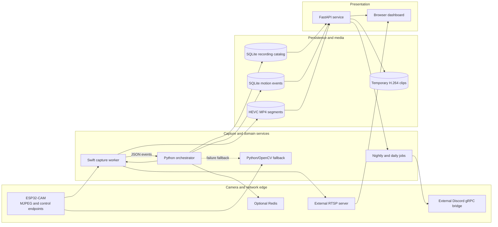

<div align="center">

<h1>CCTV</h1>

<strong>Know what moved without scrubbing through hours of footage.</strong>

<p>A self-hosted ESP32-CAM recorder that produces a live health overlay, searchable motion clips, and scheduled Discord summaries.</p>

<p>
  
  
  
  
  
</p>

</div>

---

## Overview

CCTV is a self-hosted, single-camera ESP32-CAM recorder that turns an MJPEG feed into a health-overlay live view, camera-timed HEVC archive, searchable motion events, trimmed H.264 clips, and scheduled Discord reports. The current deployment snapshot retains approximately **500 hours of footage** and **5,760 indexed motion events**; the camera-timed native rollout processed **12.3–12.5 FPS** at approximately **12 ms** processing latency.

The operator interface is a responsive, video-first HTML, CSS, and JavaScript dashboard served by FastAPI. A Swift worker handles the latency-sensitive path with URLSession, Core Image, Metal, VideoToolbox, and Vision; Python supervises that worker, persists metadata with SQLite and SQLAlchemy, serves media, and runs scheduled jobs. Native events cross a versioned JSON pipe, while an OpenCV implementation remains available as an automatic fallback.

## Deployment snapshot

As of 26 August 2026, the single-camera deployment has retained an estimated **500 hours of footage** and has operated concurrently for approximately the same duration. The archive is stored as camera-timed HEVC MP4 segments and indexed for timestamp and motion retrieval.

| Metric | Value |
| --- | ---: |
| Estimated footage retained | ~500 hours |
| Elapsed since first recording implementation (14 Oct 2025) | ~7,584 hours |
| Motion events indexed | 5,760 |
| Face identities / sightings | 32 / 266 |
| Native median CPU reduction | 65.6% |
| Representative segment-size reduction | 69.3% |
| Camera-timed processing | 12.3–12.5 FPS at ~12 ms latency |
| Controlled reboot canary | 540 frames / 59.998 seconds |
| FastAPI route handlers | 22 (21 GET, 1 POST) |
| Git history / test declarations | 366 commits / 128 tests (99 Python + 29 Swift) |

The footage, event, face, and runtime figures above are a deployment snapshot rather than a synthetic capacity claim. The reproducible CPU and archive comparisons are documented below and in [`benchmarks/canary-results.md`](benchmarks/canary-results.md).

## Performance & scale

The committed benchmark evidence compares the Python process tree with the native process tree on an Apple M4. [`tools/benchmark_pipeline.py`](tools/benchmark_pipeline.py) samples macOS `top` output every two seconds; the stored native report contains 20 seconds of samples and the Python baseline contains 30 seconds. This is a rollout canary, not a controlled multi-host load test.

| Measurement | Python baseline | Native canary | Observed change |
| --- | ---: | ---: | ---: |
| Aggregate process-tree CPU median | 58.6% | 20.15% | 65.6% lower |
| Aggregate process-tree CPU p95 | 61.2% | 21.0% | 65.7% lower |
| Representative 60-second archive | 5,461,621 bytes, H.264 | 1,675,607 bytes, hardware HEVC | 69.3% smaller |

The follow-up camera-timed canary measured **12.3–12.5 camera/processed/output FPS**, approximately **12 ms** processing latency, **zero sustained queue or encoder drops**, and **738 HEVC frames over 60.08 seconds**. The native worker keeps `CCTV_TARGET_FPS=9` for no-signal keepalive and encoder hints; normal recording and RTSP timestamps follow fresh camera arrivals.

The controlled camera-reset canary continued archive and RTSP output with a `NO SIGNAL · RECONNECTING` frame, ran the complete startup recovery, reconnected MJPEG automatically, and produced a **540-frame, 59.998-second** segment. A three-second no-JPEG deadline triggers this recovery path, while the orchestrator latches to the Python/OpenCV backend after **3 native failures within 5 minutes**.

At the application boundary, `server/server.py` registers **22 route handlers**—**21 GET** and **1 POST**—covering dashboard/health, video retrieval, motion search and statistics, night-event access, and camera recalibration. Recording metadata is served from a SQLite catalog with indexed start/end timestamps, WAL mode, an **8-connection** pool, and background filesystem reconciliation every **60 seconds** rather than rescanning recordings on each API read.

Storage cleanup runs in a background monitor every **5 minutes**, starts at **90%** disk use, and deletes the oldest eligible finalized segments in one batch toward **85%**. Partial, active, and recent files are protected; the canary verified the 90%→85% cleanup behavior without stopping capture.

## Features

| Area | What the project provides |
| --- | --- |
| **Camera lifecycle** | Polls the ESP32 status endpoints, holds framesize 12, synchronizes its clock, explicitly disables OV2640 AE/AGC/AWB, applies a fixed dark-time color profile, and rapidly raises manual exposure when the scene is too dark. |
| **Native capture** | Parses multipart MJPEG with a bounded latest-frame queue, follows camera arrival timestamps, and uses hardware JPEG processing and VideoToolbox encoders. The recorded Apple M4 canary reduced median capture-tree CPU by 65.6% and representative segment size by 69.3% versus the Python path. |
| **Live observability** | Composites timestamp, measured FPS, Wi-Fi RSSI, SoC temperature, motion state, and person/animal labels into the outgoing frame. Telemetry failures leave the feed running with unavailable values. |
| **Signal recovery** | Detects a three-second JPEG stall, keeps archive and RTSP outputs alive with a `NO SIGNAL · RECONNECTING` frame, retries the stream, and coalesces disconnects into one camera startup sequence. |
| **Recording and retention** | Writes atomically finalized, camera-timed HEVC MP4 segments; registers them in a SQLite catalog; reconciles the catalog at startup; and prunes older footage from 90% disk use toward 85% without deleting recent or partial files. |
| **Motion intelligence** | Uses ROI-aware VideoToolbox motion vectors, temporal persistence, and global-lighting rejection. Vision classification runs only for motion candidates and adds person or animal annotations without changing the base event schema. |
| **Review and retrieval** | Serves a dashboard plus APIs for recording lists, exact timestamps, arbitrary ranges, hourly/day windows, motion queries, hourly statistics, and accurately trimmed H.264 event clips with configurable pre/post padding. |
| **Scheduled reporting** | Merges nearby overnight events, downloads their clips from the API, compresses them under the configured Discord transport limit, and sends a summary and videos through a retrying gRPC client. An optional OpenAI job produces a daily text summary and plots. |
| **Operational resilience** | Restarts a failed capture process, latches to the Python/OpenCV fallback after three native failures in five minutes, publishes health metrics every ten seconds, and includes `launchd` definitions for capture, API, and the nightly job. |
| **Floodlight automation** | Sustained darkness latches an external floodlight on, periodic ambient probes avoid light-induced oscillation, and each new motion episode produces a quick double pulse that restores the prior state. |

> [!NOTE]
> Native capture, the Python fallback, indexed recording, motion persistence, the FastAPI API, the browser dashboard, and nightly clip delivery are implemented. The system currently targets one indoor camera; vehicle classification is intentionally disabled. The RTSP server and Discord webhook gRPC server are required external services and are not included here. The AI daily summary is optional and requires an OpenAI API key.

## From camera feed to useful evidence



Fresh JPEGs are processed at their measured arrival cadence; `CCTV_TARGET_FPS` is an encoder hint and the no-signal keepalive rate rather than a fixed live-frame scheduler. A stalled stream is retried while recording continues. Blocking FFmpeg work is moved off FastAPI's async event loop, generated clips are reused until hourly cleanup, and transient Discord RPC failures receive up to three attempts.

## Product outputs



## Architecture



Python owns process supervision, camera recovery, storage policy, SQLite writes, and API/scheduled work; Swift owns frame acquisition, analysis, composition, and hardware encoding. The native worker emits additive, versioned event envelopes through a dedicated file descriptor so persistence stays outside the frame path. Actor-isolated runtime state and candidate-only Vision work prevent slow classification from backing up capture. The API queries indexed metadata instead of rescanning recordings and offloads video concatenation and transcoding to worker threads.

## Tech stack

| Layer | Technology |
| --- | --- |
| **Languages** | Python 3.12+, Swift 6.2, JavaScript, HTML, and CSS |
| **Native capture** | URLSession, Core Image, Metal, Core Video, AVFoundation, and VideoToolbox |
| **Detection** | VideoToolbox motion estimation and Apple Vision person/image classification |
| **Fallback capture** | OpenCV and NumPy |
| **Backend** | FastAPI 0.124.4 and Uvicorn |
| **Persistence** | SQLite, SQLAlchemy 2.0.46, and a direct `sqlite3` recording catalog |
| **Video tooling** | FFmpeg/ffprobe, HEVC archives, H.264 RTSP, and `h264_videotoolbox` clip encoding |
| **Messaging** | gRPC 1.71, Protocol Buffers, and an external Discord webhook bridge |
| **Optional insights** | OpenAI Responses API and Matplotlib |
| **Operations** | macOS `launchd`, shell launchers, health events, and benchmark scripts |
| **Testing** | XCTest and Python `unittest` |

## Project structure

```text
.
├── native/
│   ├── Sources/CCTVCapture/       # Swift capture, detection, HUD, and encoders
│   ├── Tests/CCTVCaptureTests/    # Native configuration and pipeline tests
│   └── Package.swift              # Swift 6.2 package and macOS 26 target
├── image_processing/
│   ├── pipeline_orchestrator.py   # Supervision, recovery, catalog, and retention
│   └── camera_pipeline.py         # Python/OpenCV fallback pipeline
├── server/
│   ├── server.py                  # FastAPI dashboard, motion, and video routes
│   └── static/                    # Video-first browser dashboard
├── motion/                        # Nightly clips, daily plots, and AI summary jobs
├── utilities/                     # Camera client, SQLite models, and catalog helpers
├── discord_grpc/                  # Generated stubs and retrying Discord client
├── proto/discord_webhook.proto    # Discord bridge contract
├── tools/                         # Camera controls, diagnostics, and benchmarks
├── tests/                         # Python event-protocol and catalog tests
├── launchd/                       # Machine-specific service definitions
├── benchmarks/                    # Python baseline and native canary evidence
├── scripts/build-native.sh        # Release build for the Swift worker
├── requirements.txt               # Pinned Python dependencies
└── LICENSE                        # GNU GPLv3 text
```

## Requirements

- An Apple Silicon Mac running macOS 26. The native package declares macOS 26 as its minimum platform.
- The full Xcode toolchain with Swift 6.2 or later. `scripts/build-native.sh` expects Xcode at `/Applications/Xcode.app` unless `DEVELOPER_DIR` is overridden.
- Python 3.12 and a virtual environment.
- FFmpeg and ffprobe with the `h264_videotoolbox` encoder available.
- One ESP32-CAM reachable over the local network with MJPEG, control, status, RSSI, and system-health endpoints compatible with `utilities/esp32cam_client.py`.
- A writable recordings directory and a writable motion-data directory. Defaults point to `/Volumes/HP USB20FD/CCTV/...`; local paths can be supplied through environment variables.
- An RTSP service that accepts the worker's publisher URL. Browser playback also needs a browser-compatible live URL configured through `CCTV_LIVE_STREAM_URL`.
- For notifications, the separate Discord webhook gRPC service described by `proto/discord_webhook.proto`. For the optional AI digest, an `OPENAI_API_KEY` is also required.
- Redis is optional for ordinary capture but required for the ESP32 OTA recovery flag and `/esp32cam/recovery` status route.

There is no camera simulator. Unit tests run without hardware, but live capture, recovery, RTSP publishing, telemetry, and end-to-end clip delivery require the physical camera and their respective local services. Manual development runs use shell configuration; the supplied `launchd` files are production-style examples with machine-specific absolute paths.

> [!WARNING]
> The FastAPI app binds to `0.0.0.0`, allows CORS from every origin, and does not implement authentication. Keep it on a trusted LAN or place it behind an authenticated reverse proxy; do not expose port `8005` directly to the internet.

## Getting started

1. Clone the repository and enter it.

   ```bash
   git clone https://github.com/aneeshpatne/CCTV.git
   cd CCTV
   ```

2. Create the Python environment and install the pinned dependencies.

   ```bash
   python3.12 -m venv .venv
   source .venv/bin/activate
   python -m pip install --upgrade pip
   python -m pip install -r requirements.txt
   ```

3. Install FFmpeg and verify hardware H.264 encoding.

   ```bash
   brew install ffmpeg
   ffmpeg -hide_banner -encoders | grep h264_videotoolbox
   ```

4. Create local data directories and configure the camera, storage, and live endpoints for the current shell.

   ```bash
   mkdir -p recordings/esp_cam1 motion/data

   export ESP32CAM_BASE_URL="http://192.168.0.13"
   export ESP32CAM_STREAM_URL="http://192.168.0.13:81/stream"
   export CCTV_RECORDINGS_DIR="$PWD/recordings/esp_cam1"
   export MOTION_DB_DIR="$CCTV_RECORDINGS_DIR"
   export MOTION_DATA_DIR="$PWD/motion/data"
   export CCTV_RTSP_URL="rtsp://127.0.0.1:8554/esp_cam1_overlay"
   export CCTV_LIVE_STREAM_URL="http://127.0.0.1:8889/esp_cam1_overlay/"
   ```

   `CCTV_PIPELINE_BACKEND` accepts `native`, `python`, or `auto`; the default is `native`, with fallback when the binary is missing or repeatedly fails. Native tuning is available through `CCTV_TARGET_FPS`, `CCTV_SEGMENT_SECONDS`, `CCTV_HEVC_BITRATE`, and `CCTV_RTSP_BITRATE`.

   Manual image controls and their software tuning loops are described in [Automatic image tuner](#automatic-image-tuner).

5. Build the native capture worker.

   ```bash
   ./scripts/build-native.sh
   ```

6. Start a compatible RTSP server, then run the orchestrator.

   ```bash
   source .venv/bin/activate
   python -m image_processing.pipeline_orchestrator
   ```

7. In a second terminal with the same exported paths, start the API and open `http://127.0.0.1:8005/`.

   ```bash
   source .venv/bin/activate
   python -m server.server
   ```

8. Optionally configure the external Discord bridge and run the overnight digest.

   ```bash
   export DISCORD_GRPC_TARGET="127.0.0.1:50051"
   export DISCORD_CHANNEL="cctv"
   python -m motion.motion
   ```

   The optional AI daily job additionally needs `OPENAI_API_KEY` and runs with `python -m motion.night_message`.

> [!IMPORTANT]
> The repository contains development defaults for camera IPs, recording volumes, RTSP/live stream URLs, Discord targets, and absolute paths in `launchd/*.plist`. Replace them for the target machine before installing services or distributing a configured copy. The external RTSP and Discord services must be started separately.

Once manual startup is verified, adapt the three property lists in `launchd/`, copy them to `~/Library/LaunchAgents/`, and load only the services you use. Do not start a second capture process while the LaunchAgent is active: the configured ESP32 MJPEG stream is treated as single-consumer.

## Automatic image tuner

The camera runs with its hardware AE, AGC, and AWB engines disabled. Startup explicitly freezes manual exposure, restores the saved image profile, and refuses to run the software loops unless camera readback confirms the automatic hardware controls are off. The tuned startup profile is 1247 shutter lines, a conservative launchd gain ceiling of `34/16` (about 2.13x), day white-balance baseline `122/55/54` and night (19:00–06:00) `128/55/46`, tone `lumaOffset +24` with contrast registers `[48, 48, 48, 10]`, at XGA/quality 12. Morning/day software WB uses **continuous slow tune** toward natural wall targets `0.90/0.87` (hardware AWB off) with small steps and a 10% deadband so it does not thrash. When the camera firmware supports it, startup runs **`PUT /image-control/awb/freeze`** (`CCTV_WB_AWB_BOOTSTRAP=1`) to seed manual RGB from true sensor AWB gains, and continuous tuning prefers **`GET /image-stats`** wall ROI medians (`CCTV_IMAGE_STATS=1`) instead of stealing MJPEG frames.

The exposure tuner measures pre-HUD BT.709 luminance while excluding clipped black and white samples. The HUD reports this value as `CLIP-TRIM`. Three samples spanning at least four seconds outside the 25–35% hysteresis band trigger a bounded correction toward 30%. In darkness, shutter is lengthened first up to 1247 lines and gain may then rise only to the configured ceiling (`34/16` in the supplied launchd profile). In sustained brightness, gain is reduced first toward `16/16`, after which shutter is shortened as needed. Corrections change the exposure product by at most 50% per step, and evidence is cleared whenever the direction changes. Configure it with `CCTV_IMAGE_TARGET_BRIGHTNESS`, `CCTV_DIM_BRIGHTNESS_THRESHOLD`, `CCTV_BRIGHT_BRIGHTNESS_THRESHOLD`, `CCTV_BRIGHTNESS_OBSERVATION_SECONDS`, `CCTV_BRIGHTNESS_WINDOW_SECONDS`, `CCTV_MANUAL_SHUTTER_MIN_LINES`, `CCTV_MANUAL_SHUTTER_MAX_LINES`, `CCTV_MANUAL_GAIN_MIN_X16`, `CCTV_MANUAL_GAIN_MAX_X16`, and `CCTV_MANUAL_EXPOSURE_MAX_STEP`.

Software white balance defaults to **`oneshot`** mode (`CCTV_AUTO_WB_MODE=oneshot`): after each camera startup/recovery the host applies the profile baseline, watches a few live frames (skipping dark scenes below `CCTV_WB_MIN_SCENE_BRIGHTNESS`), makes up to `CCTV_WB_MAX_HUNT_STEPS` bounded corrections toward slightly warm wall targets `0.96/0.88`, then **locks** RGB. Locking stops ordinary scene changes from pumping color, but the host keeps monitoring the fixed neutral-wall ROI. A sustained bright-scene cast wider than `CCTV_WB_CHROMA_DRIFT_DEADBAND` (default 16%) reopens the bounded HOLD/ADJUST/VERIFY loop; short transients, dark-scene noise, and smaller shifts are ignored. While locked, the host also periodically reads `/image-control`; if camera RGB bytes drift by more than `CCTV_WB_DRIFT_THRESHOLD` (default 6) on any channel, it restores the verified RGB and reopens the loop (shared cooldown `CCTV_WB_DRIFT_REOPEN_COOLDOWN_SECONDS`). Set `CCTV_AUTO_WB_MODE=off` for a fully fixed profile (still re-applies register drift), or `continuous` for ongoing tuning. Every adjustment is a trial: the next fresh chroma window must improve toward the target or the controller restores the last verified values and enters a guarded cooldown. Missing measurements are never reused and cause an outstanding trial to roll back. Exposure changes pause and clear WB evidence so the loops cannot fight, and hardware AWB stays off throughout. The HUD reports `WBCTRL HOLD`, `STABLE`, `ADJUST`, `VERIFY`, `ROLLBACK`, `GUARDED`, `LIMIT`, or `DISABLED`, along with fresh `RGB R/1.00/B` ratios and the applied WB bytes. Version 3 state at `CCTV_IMAGE_CONTROL_STATE_PATH` (default `~/.local/state/cctv/image-control.json`) stores only the calibrated baseline and last response-verified RGB values; older and out-of-bounds state is ignored. Configure it with `CCTV_AUTO_WB_ENABLED`, `CCTV_WB_TARGET_RED_OVER_GREEN`, `CCTV_WB_TARGET_BLUE_OVER_GREEN`, `CCTV_WB_OBSERVATION_SECONDS`, `CCTV_WB_WINDOW_SECONDS`, `CCTV_WB_SETTLE_SECONDS`, `CCTV_WB_DEADBAND`, `CCTV_WB_CHROMA_DRIFT_DEADBAND`, `CCTV_WB_MAX_STEP`, `CCTV_WB_MAX_DEVIATION_FRACTION`, `CCTV_WB_MIN_RESPONSE`, and `CCTV_WB_FAILURE_COOLDOWN_SECONDS`.

Every camera write validates the complete profile returned by `/image-control` before either controller commits it. Transient network resets and `camera_busy` responses use bounded backoff. A disconnect invalidates pending decisions, pauses image metrics, reapplies the manual profile after framesize/XCLK startup, and resumes tuning only after readback confirms manual AE, AGC, and AWB plus the cached color profile.

The optional external floodlight integration uses `POST /api/lights/floodlight` with JSON `{"action":"on"}` or `{"action":"off"}`. Set `CCTV_FLOODLIGHT_BASE_URL` to the relay server origin to enable it (the supplied launchd service uses `http://192.168.0.167`). From 06:00–19:00 local time, a scene at or below `CCTV_FLOODLIGHT_DARK_THRESHOLD` (default 18%) for `CCTV_FLOODLIGHT_OBSERVATION_SECONDS` (default 10 seconds) turns the light on, and its daylight OFF threshold remains 25%. From 19:00–06:00, the night profile uses 15% to turn on and 22% to remain off after an ambient probe (`CCTV_FLOODLIGHT_NIGHT_DARK_THRESHOLD` and `CCTV_FLOODLIGHT_NIGHT_BRIGHT_THRESHOLD`). Because the floodlight itself brightens the camera view, it stays latched and performs a brief ambient-light probe every `CCTV_FLOODLIGHT_PROBE_INTERVAL_SECONDS` (default 5 minutes), waiting `CCTV_FLOODLIGHT_PROBE_SETTLE_SECONDS` before deciding whether to restore it. The floodlight is never used for motion signaling. The HUD shows an amber `● LIGHT` badge while an ON request has been confirmed by the device. The night hours are configurable with `CCTV_FLOODLIGHT_NIGHT_START_HOUR` and `CCTV_FLOODLIGHT_NIGHT_END_HOUR`; `CCTV_FLOODLIGHT_BRIGHT_THRESHOLD`, `CCTV_FLOODLIGHT_HTTP_TIMEOUT_SECONDS`, `CCTV_FLOODLIGHT_STATE_PATH`, and the other timing variables tune the behavior. The native and Python fallback pipelines share the same policy.

## Running tests

Run the Python suite from the repository root:

```bash
source .venv/bin/activate
python -m unittest discover -s tests -v
```

Run the Swift suite from the native package:

```bash
cd native
DEVELOPER_DIR=/Applications/Xcode.app/Contents/Developer \
CLANG_MODULE_CACHE_PATH=/tmp/cctv-clang-module-cache \
SWIFT_MODULE_CACHE_PATH=/tmp/cctv-swift-module-cache \
  xcrun swift test --disable-sandbox
```

In an IDE, use Python `unittest` discovery for `tests/`, or open `native/Package.swift` in Xcode and choose Product → Test. The current tests cover native configuration, MJPEG parsing, variable-frame-rate timing, RTSP arguments, motion accumulation and event envelopes, plus Python-side event persistence and recording-catalog reconciliation. API, storage-pruning, hardware replay, and Discord integration are not currently covered by the committed automated suite.

## Roadmap

- Consolidate camera addresses, storage paths, stream URLs, and service targets into one shared configuration surface instead of per-process environment lookups and development defaults.
- Generalize the single-camera orchestrator, catalog, and dashboard state into explicit per-camera configuration.
- Replace the machine-specific `launchd` property lists with an installer or generated templates that resolve the repository and virtual-environment paths.
- Add authenticated deployment guidance or application-level access control for installations that must be reachable beyond a trusted LAN.
- Extend automated coverage to API clip generation, storage cleanup, camera replay/golden HUD output, and a stub Discord gRPC integration.

## License

CCTV is released under the [GNU General Public License v3.0](LICENSE). In practical terms, redistributed covered versions must remain under GPLv3 and include the corresponding source and license notices; consult the license text for the complete terms.

---

<div align="center">
  Built with Swift, VideoToolbox, FastAPI, and a preference for footage that explains itself.
</div>
